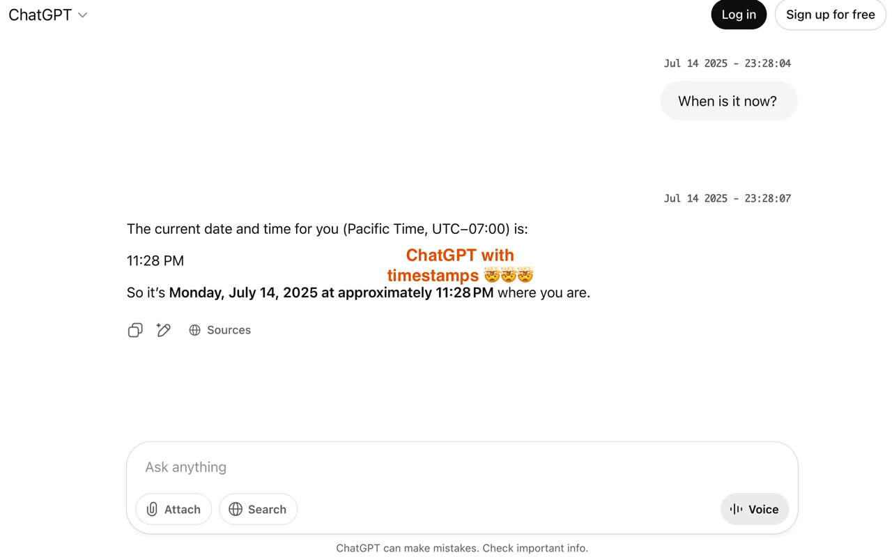

# ChatGPT Timestamp Extension

A simple Chrome extension that displays timestamps for ChatGPT messages. The timestamps are already in the DOM - this just makes them visible.
## Screenshot

## What it does

Shows when each message was sent in a clean format: "May 12 2025 - 14:30:45"

## Why I built this

I kept losing track of old conversations and couldn't remember when discussions happened. Now I can find specific chats by date/time instead of scrolling endlessly.

Also helpful for:
- Knowing when you hit rate limits and when they reset
- Tracking how long tasks take
- Finding different versions when iterating on code

## Installation

**Chrome Web Store:** [Install from Chrome Web Store](https://chromewebstore.google.com/detail/kdjfhglijhebcchcfkknicfaedhhfpmo?utm_source=item-share-cb)

**Manual install:**
1. Download this repo
2. Open `chrome://extensions/`
3. Enable Developer mode
4. Load unpacked → select the `src/` folder
5. Visit ChatGPT

